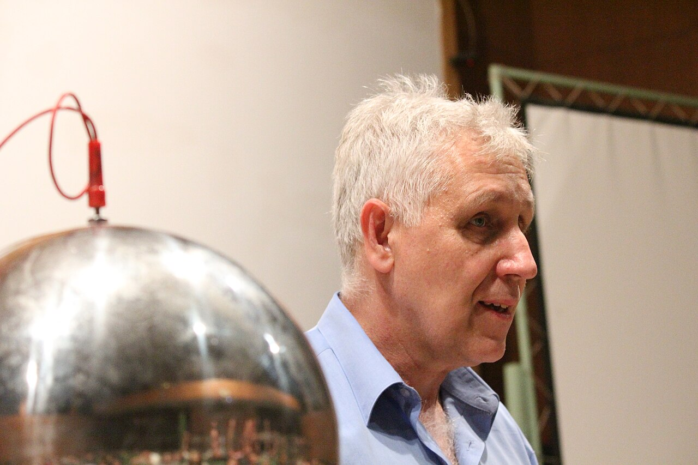

Környezetszennyezés, energiaellátás, fenntartható fejlődés ezek a legfontosabb, mindenkit érintő problémák. A természettudományok alapos ismerete adhat helyes választ korunk megválaszolandó kérdéseire és adhat megoldást problémáinkra. A fizikának nagyon fontos szerepe van a természettudományos szemlélet megalapozásában.
Ebben az előadásban az intézetünkben bemutatható kísérletekből válogatok, azt szeretném megmutatni, hogy a fizika mennyire szövi át a mindennapjainkat, és ezzel rávilágítani a fizika tudás-tanulás fontosságára.

[Härtlein Károly](https://tudprog.bme.hu/kutatok_ejszakaja/profilok/hartlein_karoly)

[BME TTK, Fizikai Intézet](https://physics.bme.hu/)

