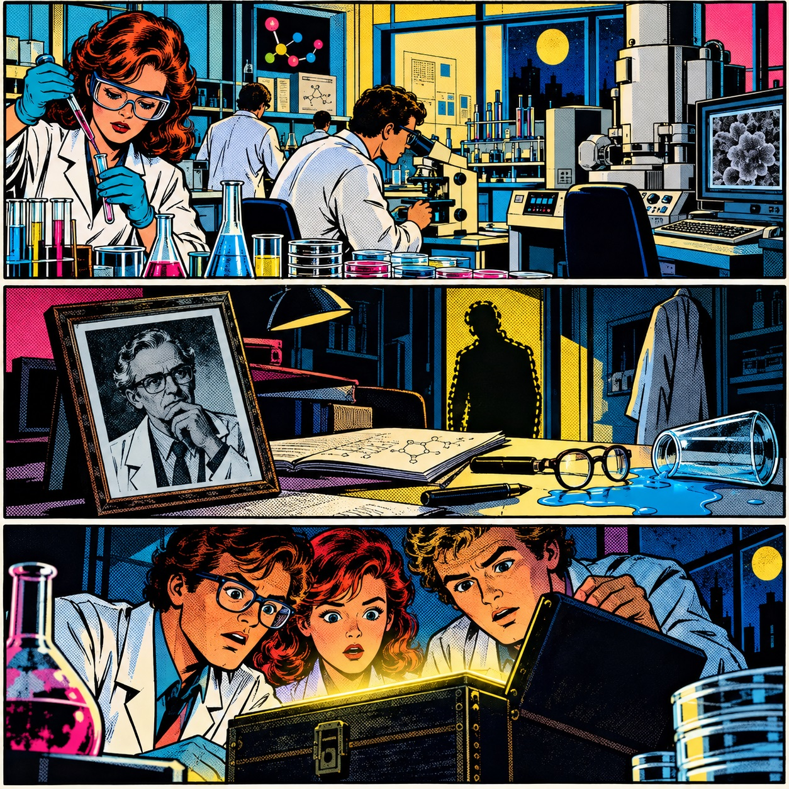

Szabadulószoba (sőt, labor!) a Műegyetemen! Játékos feladatok megoldása során ismerkedhetsz a vízkémiával, vízanalitikával, vízi közművekkel és a vízhez kapcsolódó környezeti kérdésekkel. Közben betekintést nyerhetsz a tanszékünkön folyó munkákba is. Meg tudjátok oldani a Vízlabor rejtélyét?

[Murányi Gábor](https://vkkt.bme.hu/muranyi-gabor), [A BME VKKT munkatársai](https://vkkt.bme.hu/vkkt/munkatarsak)

[BME ÉMK, Vízi Közmű és Környezetmérnöki Tanszék](https://vkkt.bme.hu/)

