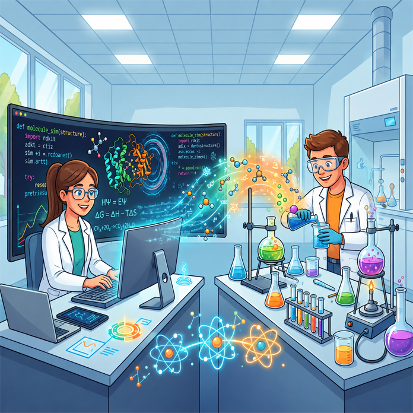

Az érdeklődők bepillantást nyerhetnek a molekuláris szervetlen kémia világába. Bemutatjuk, hogyan állítunk elő modern szervetlen anyagokat korszerű laboratóriumi módszerekkel és hogyan támogatja a számítógépes molekulamodellezés a mindennapi kutatómunkát.

[Szántai Lóránt István](https://tudprog.bme.hu/kutatok_ejszakaja/profilok/szantai_lorant_istvan), [Bartek Máté](https://tudprog.bme.hu/kutatok_ejszakaja/profilok/bartek_mate), [Szathmári Balázs](https://tudprog.bme.hu/kutatok_ejszakaja/profilok/szathmari_balazs), [Kelemen Zsolt](https://tudprog.bme.hu/kutatok_ejszakaja/profilok/kelemen_zsolt)

[BME VBK, Szervetlen és Analitikai Kémia Tanszék](http://iaachem.bme.hu/)

