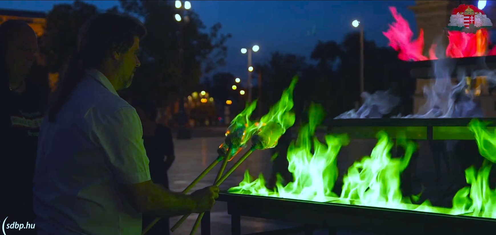

Általában a tűzijátékok során láthatjuk a színes tüzeket, láng és fényhatásokat, az kevésbé ismert, hogy a környezetünkben, valamint a hétköznapokban használt egyes anyagok a megfelelő körülmények közt lángfestést produkálnak. Bemutató, különböző anyagokkal, valamint színes lángshow magyarázattal

[Roland Alex](https://tudprog.bme.hu/kutatok_ejszakaja/profilok/roland_alex)

[BME TTK, Fizikai Intézet](https://physics.bme.hu/)

