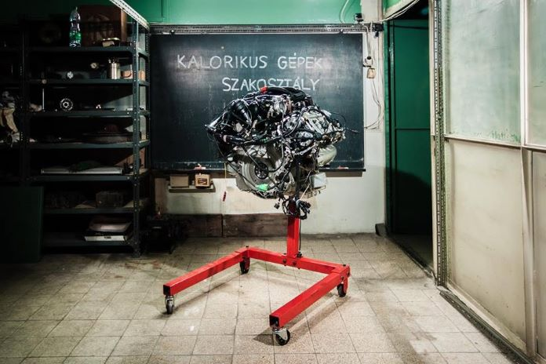

Érdekelnek a motorok? A program során megnézheted, hogy történik bennük az égés, megtudhatod hogyan hajthat meg motort pusztán egy csésze tea Nem elég? Van vízrakétánk is!

[BME GPK, Energetikai Gépek és Rendszerek Tanszék](https://www.energia.bme.hu/)

