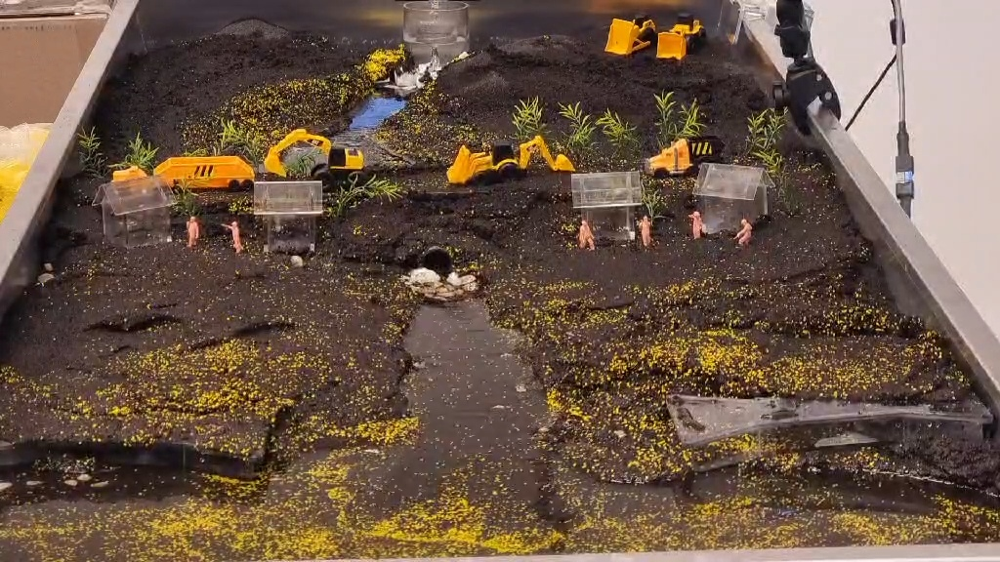

Évszázadok munkája tíz perc alatt: az asztali folyómodellben te engeded rá a vizet a homokra, és végignézed, ahogy kanyarulatot vág, zátonyt épít, medret vált. Kísérletezz velünk! Más szórakoztató feladatokkal is várunk!

[Kéri Barbara](https://tudprog.bme.hu/kutatok_ejszakaja/profilok/keri_barbara), [Nyiri Emese](https://tudprog.bme.hu/kutatok_ejszakaja/profilok/nyiri_emese), [Schrott Márton](https://tudprog.bme.hu/kutatok_ejszakaja/profilok/schrott_marton), [Tikász Gergely](https://tudprog.bme.hu/kutatok_ejszakaja/profilok/tikasz_gergely) 

[BME EMK, Vízépítési és Vízgazdálkodási Tanszék](https://vit.bme.hu/)

