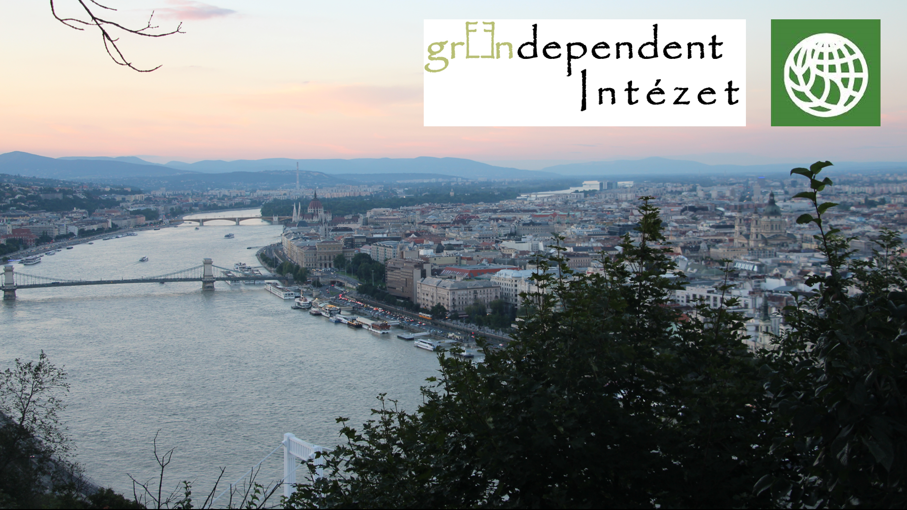

Interaktív könyvbemutató a másfélfokos városi életmódról és a körforgásos gazdaságról. Rövid előadások a nemzetközi projektek és hazai kutatás alapján, játék és közös gondolkodás mindennapi fogyasztási szokásainkról és kihívásainkról.

[Dr. Szabó Mariann](https://tudprog.bme.hu/kutatok_ejszakaja/profilok/szabo_mariann), [Vadovics Edina](https://tudprog.bme.hu/kutatok_ejszakaja/profilok/vadovics_edina), [Vadovics Kristóf](https://tudprog.bme.hu/kutatok_ejszakaja/profilok/vadovics_kristof), [Vincze Dorottya](https://tudprog.bme.hu/kutatok_ejszakaja/profilok/vincze_dorottya)

[BME GTK, Környezetgazdaságtan és Fenntartható Fejlődés Tanszék](http://kornygazd.bme.hu/hu)

