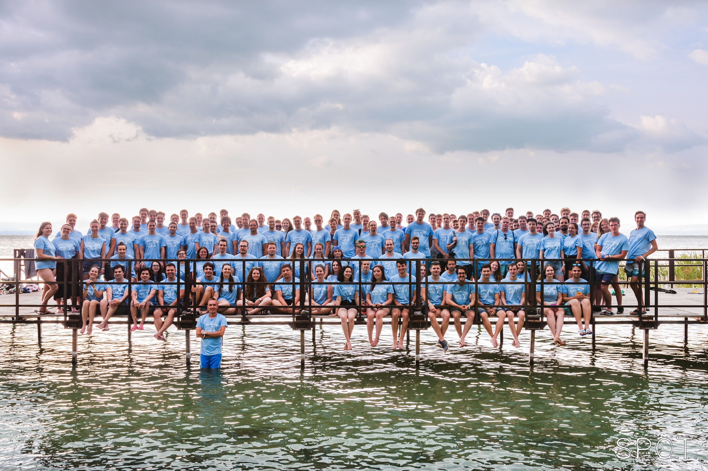

A Simonyi Károly Szakkollégium egy hallgatói szakmai szervezet, amely a BME Villamosmérnöki és Informatikai Karán működik. A szakkollégium 2003-ban vette fel Simonyi Károly, a Kar rajongva tisztelt professzora nevét. A Simonyi Károly Szakkollégium célja, hogy elsősorban a szakkollégium tagjai, lehetőség szerint a Villamosmérnöki és Informatikai Kar minden hallgatója számára lehetőséget biztosítson az egyetemi képzést kiegészítő ismeretek elsajátítására. Ennek érdekében tanfolyamokat, bemutatókat, konferenciákat és más szakmai rendezvényeket szervez, lehetőségéhez mérten infrastruktúrával támogatja a hallgatók önálló szakmai munkáit. Ezenkívül a szakkollégium céljai közé tartozik, hogy a tagjai által elért eredményeket minél szélesebb körben publikálja, a magyar felsőoktatás más egységeivel és a szakemberekkel megismertesse a szakkollégiumban folyó munkát.

 <table class="picture">
<tr>
<td>

    
  
A Simonyi Károly Szakkollégium öntevékeny körei

</td>
</tr>
</table>
