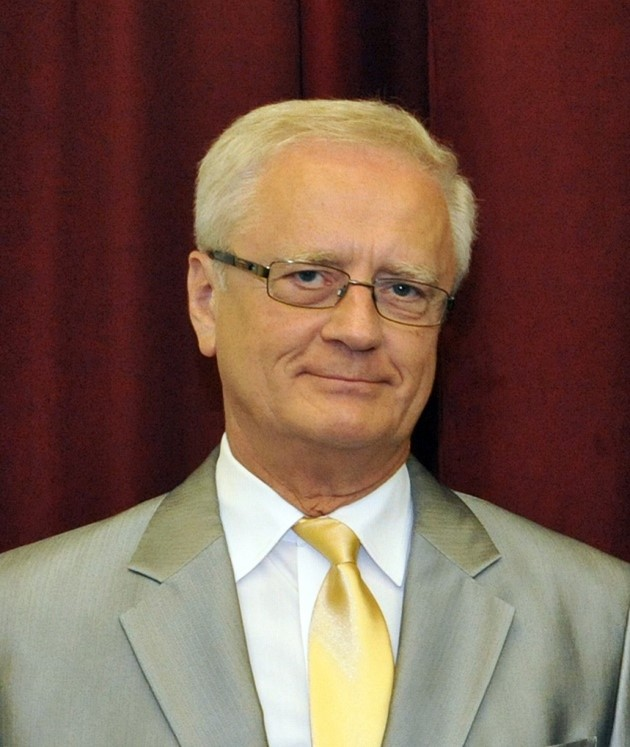

A műszaki optika professzora, fő kutatási területe az emberi színlátás és a színtévesztés korrigálása.

<table class="picture">
<tr>
<td>

    
  
Prof.dr.habil Ábrahám György

</td>
</tr>
</table>
