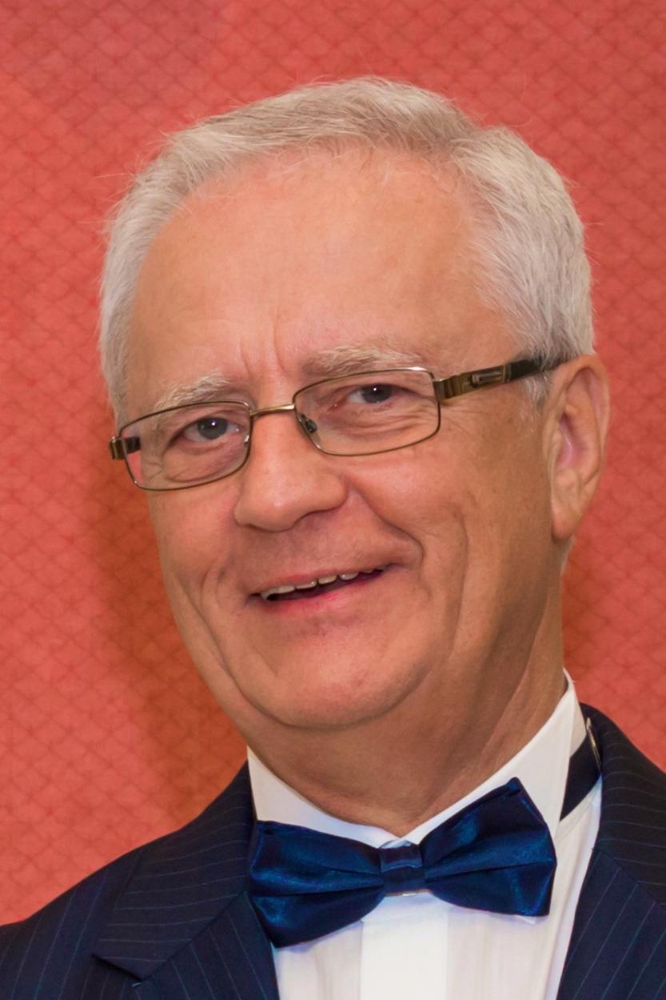

Ábrahám professzor 25 éves kutatási munkájának eredményeképpen 2021-ben a világpiacra kerülnek a színtévesztést korrigáló magyar gyártmányú színszűrős szemüvegek. 

 <table class="picture">
<tr>
<td>

    
  
Prof.dr.habil Ábrahám György

</td>
</tr>
</table>
