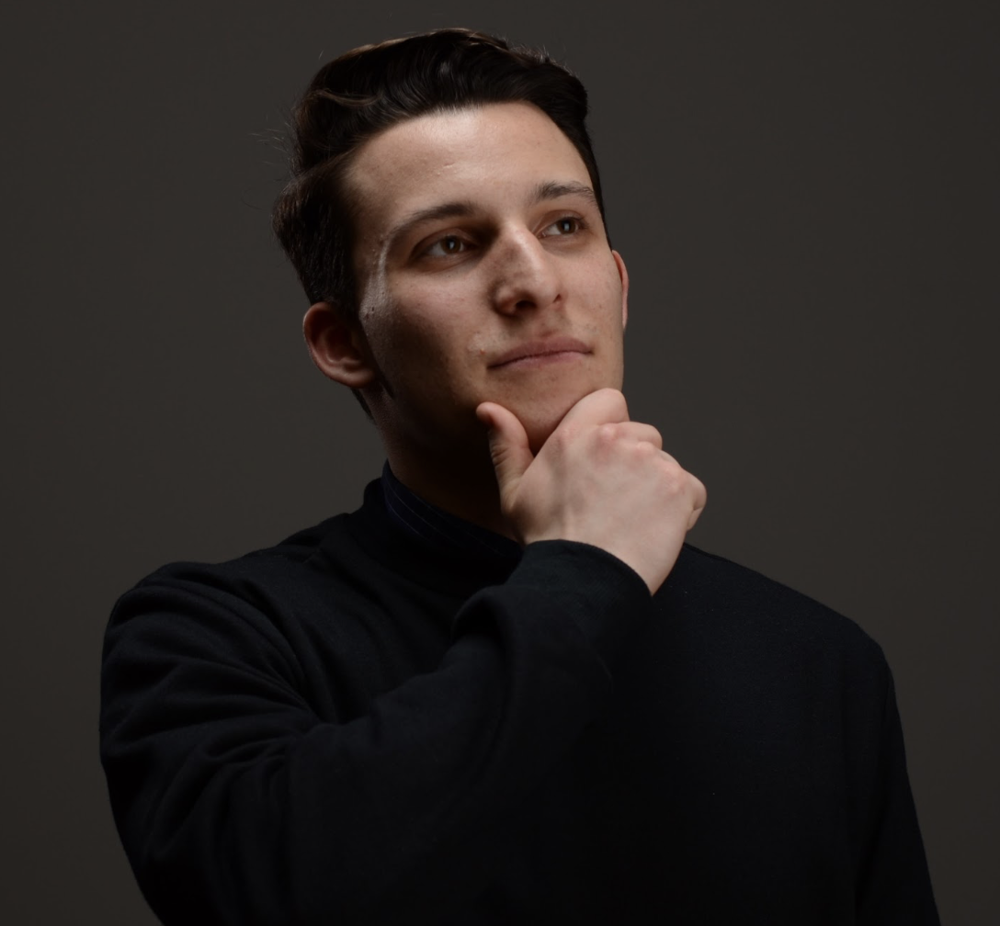

Jelenleg a BME VIK mérnökinformatikus MSc képzésének hallgatójaként folytatom tanulmányaimat. Kutatómunkám középpontjában a többágenses rendszerek orvosinformatikai modellezése, integrációja és gyakorlati implementációja áll.

 <table class="picture">
<tr>
<td>

    
  
Ágota Benedek

</td>
</tr>
</table>
