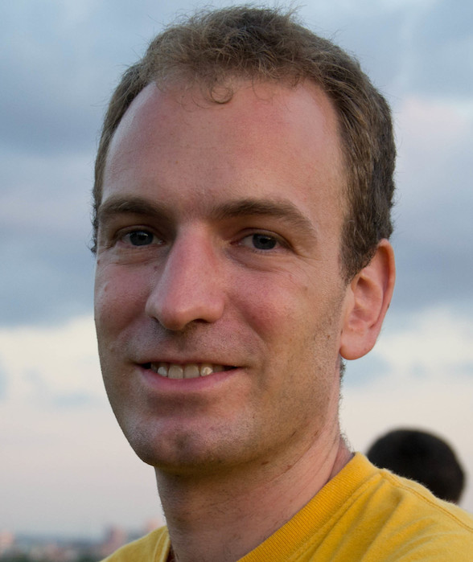

Asbóth János a BME Elméleti Fizika Tanszékének docense és a Wigner FK Kvantumoptikai és Kvantuminformatikai Osztályának tudományos főmunkatársa, a kvantumos szilárdtestfizika és a kvantuminformáció-elmélet határán végzi kutatásait.

 <table class="picture">
<tr>
<td>

    
  
Dr. Asbóth János

</td>
</tr>
</table>
