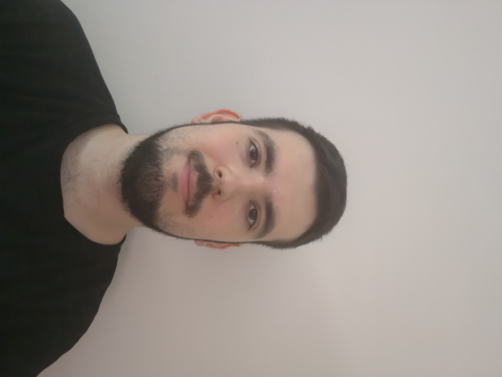

**Balázs Mátyás Krisztián** vagyok, a BME Mérnökinformatikus MSc képzésének utolsó előtti félévében járok. Az elmúlt 2 évben egy multinál voltam Java fejlesztő, jelenleg pedig szabadúszóként dolgozom saját projekteken az egyetem mellett.	

 <table class="picture">
<tr>
<td>

    
  
Balázs Mátyás Krisztián

</td>
</tr>
</table>
