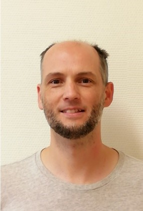

Tudományos munkatárs, BME Közlekedésmérnöki és Járműmérnöki Kar, Közlekedés- és Járműirányítási Tanszék
Tudományos főmunkatárs: ELKH SZTAKI

A BME Közlekedésmérnöki Karán végzett okleveles gépészmérnökként (repülőgépészként) 2005-ben. Ezt követően ott volt doktorandusz a Közlekedésautomatikai Tanszéken 2005 és 2008 között. Doktori (PhD) fokozatát a BME Közlekedésmérnöki és Járműmérnöki Karán szerezte meg 2013-ban. Jelenleg a BME Közlekedés- és Járműirányítási Tanszék tudományos munkatársa és az ELKH Számítástechnikai és Automatizálási Kutató Intézetének tudományos főmunkatársa. Fő kutatási területe az optikai szenzorok (kamerák) alkalmazása légieszközök (repülőgépek és helikopterek) látni és elkerülni és navigációt segítő rendszereiben. Ez kiegészül paraméter becslési és navigációs algoritmusok kutatásával, valamint légieszközök pályakövető szabályzásával. Több külföldi konferencián publikált cikkel rendelkezik, több hetet kutatott az USA-ban. 40 éves, nős. Hobbija a futás. Heti rendszerességgel a Nagytétényi Református Egyházközség tevékenységében vesz részt.

 <table class="picture">
<tr>
<td>

    
  
Dr. Bauer Péter

</td>
</tr>
</table>
