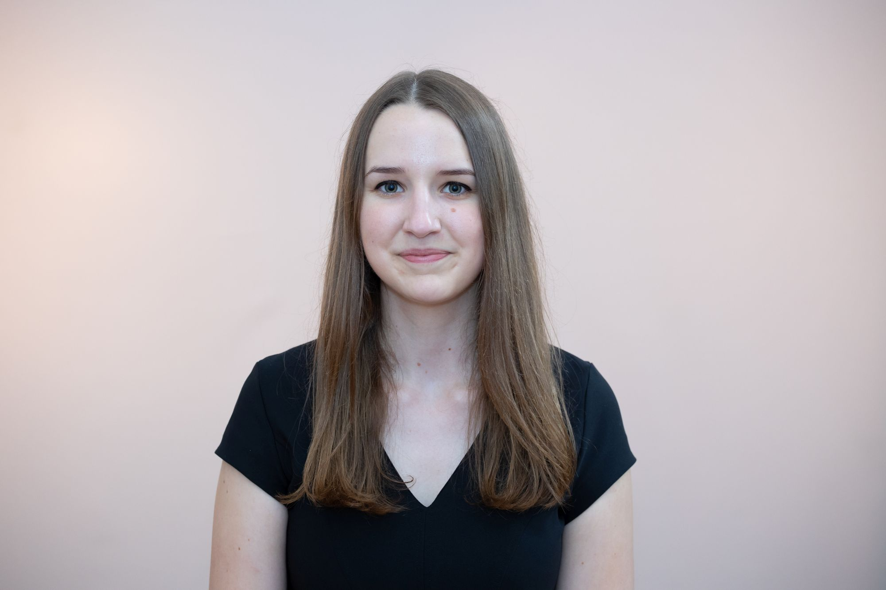

2021-ben diplomázott magyar-olasz szakos tanárként. Az ELTE PPK doktorandusza, a BME Műszaki Pedagógia Tanszékének munkatársa. Kutatási területe a magyar nyelv és irodalom tantárgy-pedagógiája.

 <table class="picture">
<tr>
<td>

    
  
Békefi Teodóra

</td>
</tr>
</table>