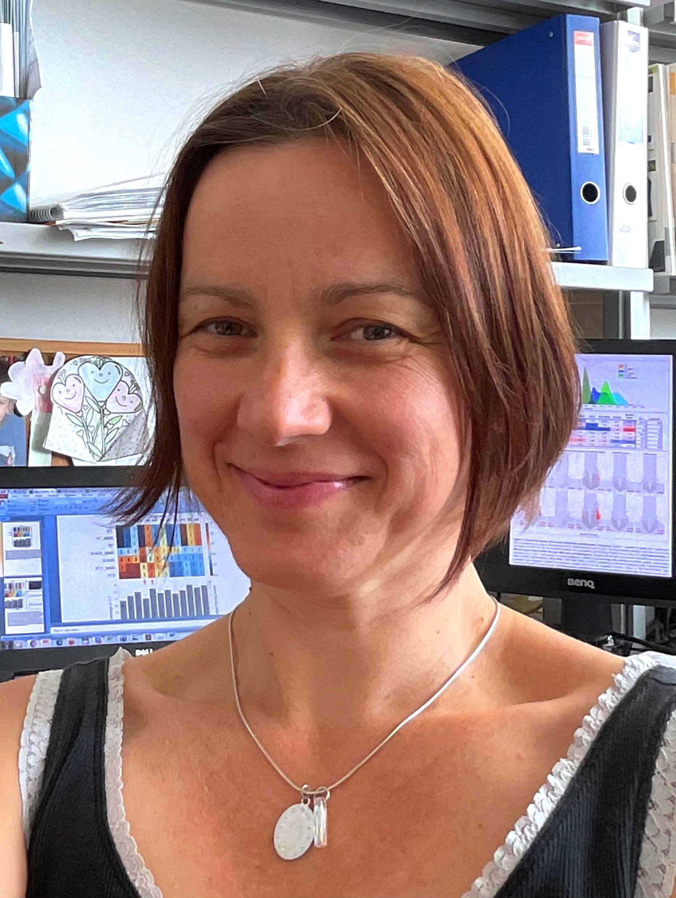

A BME VBK ABÉT tanszékén 2021-től vagyok adjunktus, kutatómunkámat a Prof. Vértessy G. Beáta vezette Genom Metabolizmus és Biostruct Kutatócsoportban végzem. Előtte és részállásban jelenleg is ugyanezen kutatócsoportnak a Hun-Ren Molekuláris Élettudományi Intézetében (korábban MTA Enzimológiai Intézetben) működő részlegén kutattam, amit egy ötéves brüsszeli posztdoktori állás szakított meg. Jelenleg funkcionális genomikai kutatásokat végzek a DNS-ben megjelenő nem kanonikus bázisok, különösen az uracil megjelenésére és biológiai szerepére és/vagy felhasználhatóságára vonatkozóan, valamint a biomérnöki MSc képzésben a bioinformatika tárgyat oktatom.

 <table class="picture">
<tr>
<td>

    
  
Dr. Békési Angéla

</td>
</tr>
</table>
