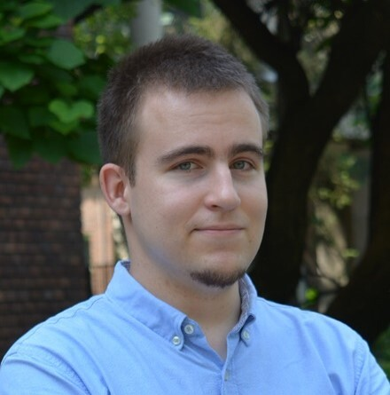

A BME TTK Kognitív Tudományi Tanszék doktori hallgatója, a Figyelem és Emlékezet Kutatócsoport tagja, érdeklődése középpontjában a végrehajtó funkciók mögött álló folyamatok szemmozgás-követéssel történő vizsgálata áll.

<table class="picture">
<tr>
<td>

    
  
Bényei Gábor

</td>
</tr>
</table>
