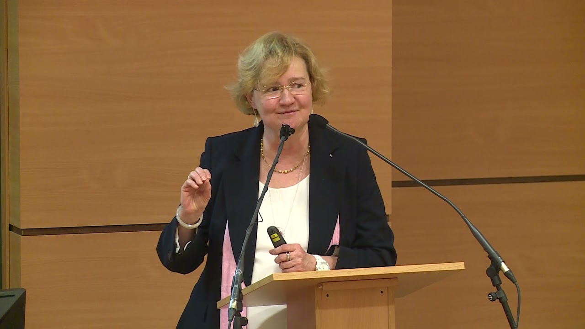

Geopolitikai szakértő, a BME Közgazdaságtan Tanszék geopolitikai oktatója. Kiemelt kutatási témái: a klasszikus geopolitikai fogalmak 21. századi értelmezése, a nagyhatalmak geopolitikai és geoökonómiai stratégiáinak összefüggései, valamint Oroszország geostratégiái a 2000. évtől napjainkig.

<table class="picture">
<tr>
<td>

    
  
Dr. Bernek Ágnes

</td>
</tr>
</table>
