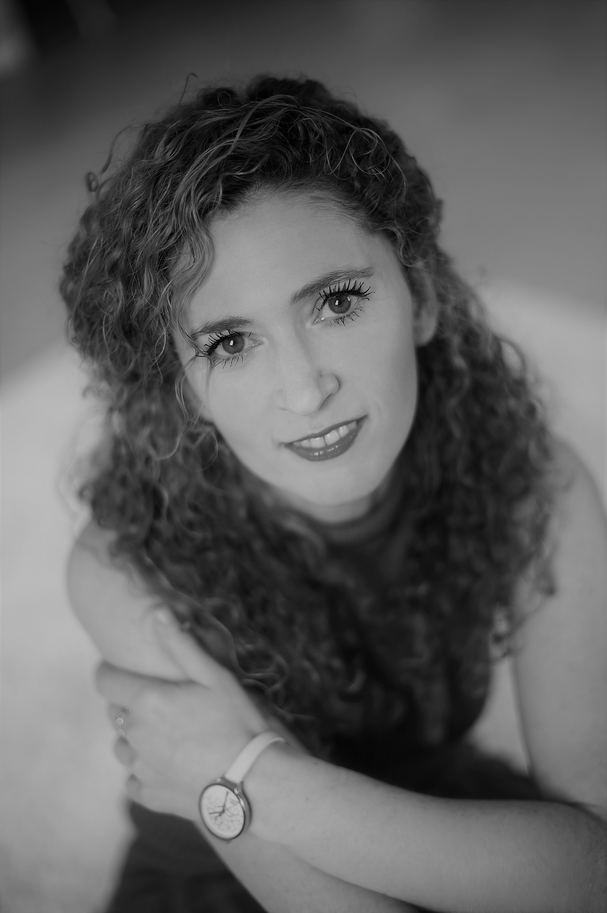

A Budapesti Corvinus Egyetem marketing mesterszakának elvégzése után az ELTE BTK Média és kommunikáció szakon is államvizsgát tett. Marketingkommunikációval, illetve médiaelmélettel kapcsolatos tantárgyakat oktat, ezekben a témakörökben kutatásokat is vezet. 2013 óta foglalkozik generációkutatással. Fokozatát 2012-ben szerezte meg a Budapesti Corvinus Egyetemen. Évek óta országos üzleti konferenciákon meghívott előadója, illetve szakmai beszélgetések moderátora. Jelenleg a Budapesti Műszaki és Gazdaságtudományi Egyetem adjunktusa.

 <table class="picture">
<tr>
<td>

    
  
Dr. Bernschütz Mária

</td>
</tr>
</table>
