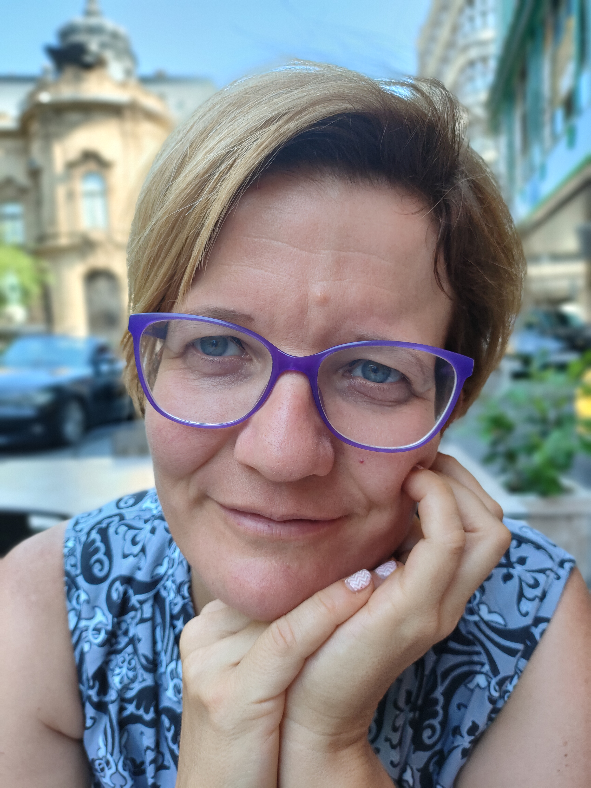

Szociodráma-vezető, kutató, a BME GTK Szociológia- és Kommunikáció Tanszékén oktató. A legkülönbözőbb társadalmi csoportokkal dolgozik együtt: elnyomottakkal és privilegizáltakkal. 
A szociodráma módszer fejlesztője, elkötelezett a szociodráma kutatási módszerként való alkalmazásának szélesebb körben való bevezetésében is. A Táguló realitás című első magyar nyelvű szociodráma könyv főszerkesztője.

 <table class="picture">
<tr>
<td>

    
  
Blaskó Ágnes

</td>
</tr>
</table>
