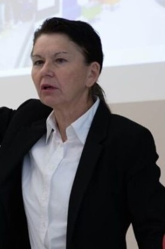

Dr. Böcskei Elvira habilitált egyetemi docens. Fő kutatási területe a pénzügyek és a számvitel. A gazdasági elemzésekkel kapcsolatos kutatásainak célja a pénzügyi döntések támogatása és a vállalati teljesítmények vizsgálata a fenntarthatósági értékek figyelembevételével.

 <table class="picture">
<tr>
<td>

    
  
Dr. Böcskei Elvira

</td>
</tr>
</table>
