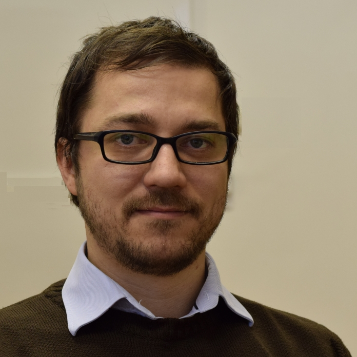

Villamosmérnökként végeztem a BME-n. A mérnökök matemaika oktatásában több, mint 15 veszek részt. Fő érdeklődési területem a dinamikai rendszerek és differenciálegyenletek.

 <table class="picture">
<tr>
<td>

    
  
Csikja Rudolf

</td>
</tr>
</table>
