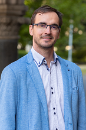

Okleveles gépészmérnök, Ph. D., jelenleg a HDR Tanszéken adjunktus pozícióban dolgozik. Fő szakterülete a nemnewtoni folyadékok vizsgálata áramlástechnikai gépek esetében. 

<table class="picture">
<tr>
<td>

    
  
Dr. Csizmadia Péter

</td>
</tr>
</table>
