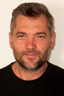

---
layout: page_kutej_profilok
tud_idopont: 0
kutej_programfelelos_eloado: Csomor Vilmos
kutej_programfelelos: 
kutej_eloado:
---
Csomor Vilmos – a BME Vasúti Járművek, Repülőgépek és Hajók Tanszékének labortechnikusa, aki a több gázturbinás próbapad létrehozásában, majd üzemeltetésében is kiemelkedő szerepet játszott több mint 25 éves pályafutása során, nemcsak saját Egyetemünkön.

 <table class="picture">
<tr>
<td>

    
  
Csomor Vilmos

</td>
</tr>
</table>
