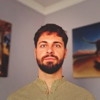

Csuvár Ádám a Környezetgazdaságtan és Fenntartható Fejlődés Tanszék egyetemi adjunktusa. A gazdaságtudomány és a környezetügyek összefonódásával kapcsolatos tárgyakat tanít, kutatásaiban főként a fenntartható energiaellátással és a körforgásos gazdasággal foglalkozik. 

[LinkedIn](https://www.linkedin.com/in/adamcsuvar/) | [Tanszéki honlap](http://kornygazd.bme.hu/hu/munkatarsak/dr-csuvar-adam)

<table class="picture">
<tr>
<td>

    
  
Dr. Csuvár Ádám

</td>
</tr>
</table>
