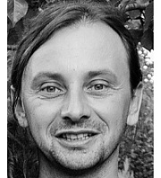

---
layout: page_kutej_profilok
tud_idopont: 0
kutej_programfelelos_eloado: Dr. Demeter Gyula
kutej_programfelelos: 
kutej_eloado:
---
Demeter Gyula több éve vesz részt neuropszichiátriai és neuropszichológiai kutatásokban és tart kurzusokat különböző neuropszichológia témákban a BME Kognitív Tanszékének oktatójaként.  
Neuropszichológusként az OMINT-OORI Agysérültek Rehabilitációs Osztályán agysérült betegek rehabilitációjában vesz részt. 

 <table class="picture">
<tr>
<td>

    
  
Dr. Demeter Gyula

</td>
</tr>
</table>
