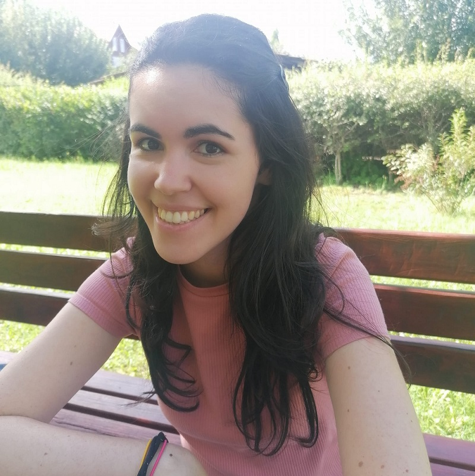

Az ELKH-BME Lendület Nyelvelsajátítás Kutatócsoport tagja, a BME Kognitív Tudományi Tanszék PhD hallgatója. Érdeklődésének középpontjában a nyelvi- és szociális képességek vizsgálata áll, amit tipikus fejlődésű és különböző fejlődési zavarokkal élő gyerekek és felnőttek körében vizsgál.

 <table class="picture">
<tr>
<td>

    
  
Dobó Dorottya

</td>
</tr>
</table>