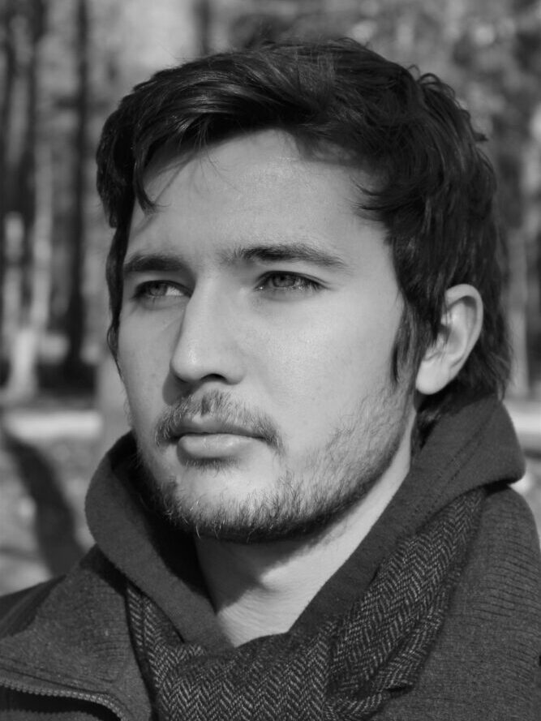

Dongó Tamás okleveles építészmérnök, a BME Villamosmérnöki és Informatikai Kar Automatizálási és Alkalmazott Informatikai Tanszékének harmadéves PhD-hallgatója. Kutatóként a közösségi várostervezéssel foglalkozik, kiemelten vizsgálva a városi döntéstámogatás informatikai hátterét, valamint annak fizikai és szoftveres megvalósíthatóságát. Szakmai munkájában az épített tér és az alkalmazott informatika határterületeit ötvözi, kutatási tevékenysége mellett pedig a Kortárs Építészeti Központ (KÉK) munkatársaként vesz részt közösségi és urbanisztikai projektekben.

 <table class="picture">
<tr>
<td>

    
  
Dongó Tamás

</td>
</tr>
</table>
