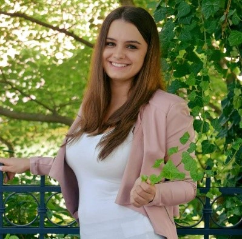

Tanulmányait a Budapest Műszaki és Gazdasági Tudomány Egyetemen a Vegyész és Biomérnök Karán MSc biomérnökként 2022ben fejezte be. 
Jelenleg a BME VBK ABÉT tanszéken folytatja doktori tanulmányait alternatív édesítőszerek innovatív biotechnológia előállításának vizsgálata címmel.

 <table class="picture">
<tr>
<td>

    
  
Eszterbauer Edina

</td>
</tr>
</table>