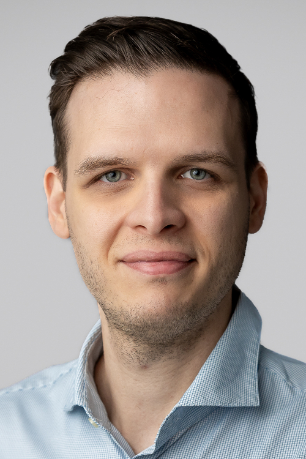

Dr. Farkas Csaba az Elektronikai Technológia Tanszék adjunktusa, a Fentartható elektronika Kutatócsoport oszlopos tagjaként foglalkozik a kifejlesztett hordozók mechanikai vizsgálataival, fárasztásos igénybevételeivel. Kopetenciái az oktatáson kívül az elektronikai gyártástechnológiák, elektonikai-, biológiai- és gépészeti anyagtudományra is kiterjed.

<table class="picture">
<tr>
<td>

    
  
Farkas Csaba

</td>
</tr>
</table>
