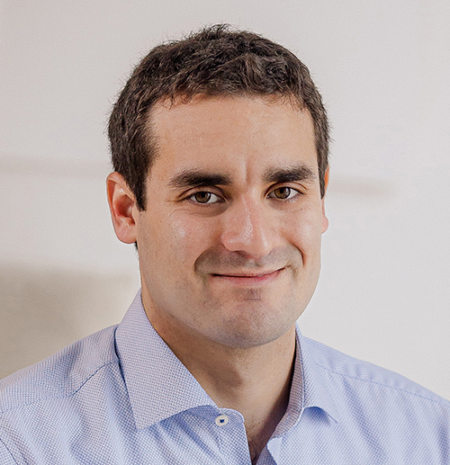

Dr. Fehér Árpád 2023. nyarán szerezte meg doktori fokozatát a közlekedés- és járműtudományok területén. Tanulmányait 2010 szeptemberében kezdte a BME Közlekedésmérnöki és Járműmérnöki Karán és 2012 óta aktív tagja és munkatársa a BME Közlekedés- és Járműirányítási Tanszéknek. Fő kutatási területe az autonóm járművekkel kapcsolatos gépi tanuló algoritmusok tervezése. Az elmúlt években számos ipari és demonstrációs munkában végzett fejlesztési tevékenységet valós járműveken tesztpályás környezetben. Ezeknél lehetősége volt integrálni az egyetemi tanulmányai alatt megszerzett járműmechatronikai ismereteit a mesterséges intelligencia alapú kutatási témáival. 2013 óta foglalkozik járműfedélzeti vezérlőegységek nyomtatott áramköreinek tervezésével és azok programozásával, amit azóta is rendszeresen oktat. Oktatóként jelentős figyelmet fordít a hallgatók projektfeladatokban végzett tevékenységére, melyek során számos sikeres TDK munkánál és szakdolgozatnál vállalt konzulensi szerepet.

 <table class="picture">
<tr>
<td>

    
  
Dr. Fehér Árpád

</td>
</tr>
</table>
