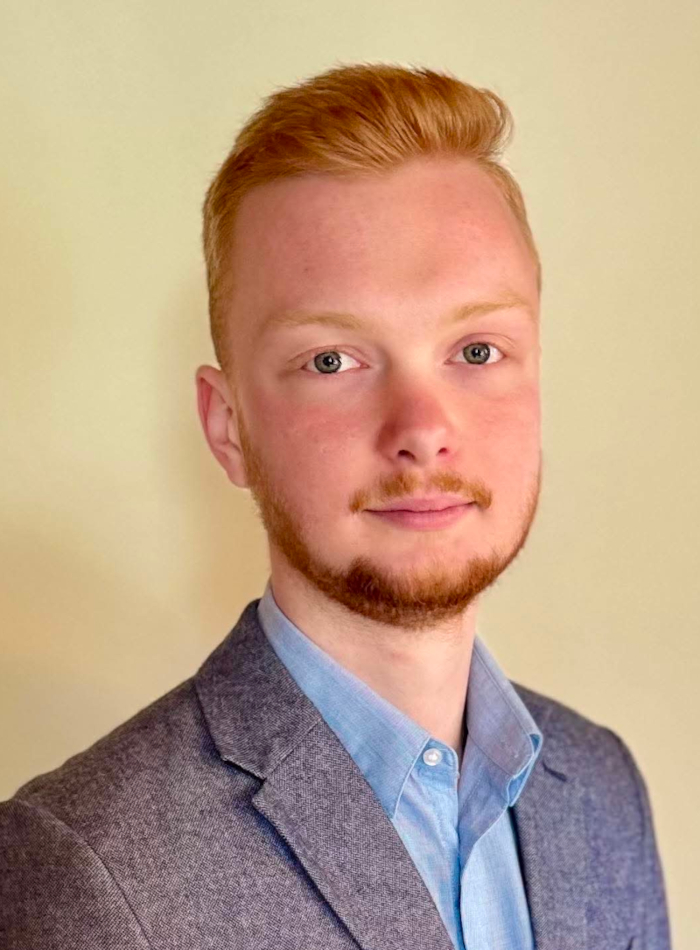

A BME Elektronikai Technológia Tanszék hallgatója. Fő kutatási területe a lebontható, PLA-alapú elektronikai hordozók vizsgálata, emellett pedig szívesen foglalkozik hardvertervezéssel és programozással is.

 <table class="picture">
<tr>
<td>

    
  
Fehér László

</td>
</tr>
</table>