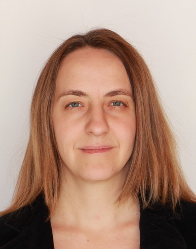

Biomérnök, egyetemi docens, szakterülete a környezettoxikológia, a környezeti mikrobiológia és a szennyezett talajok és hulladékok kezelése biotechnológiákkal.

<table class="picture">
<tr>
<td>

    
  
 Dr. Feigl Viktória Dóra

</td>
</tr>
</table>
