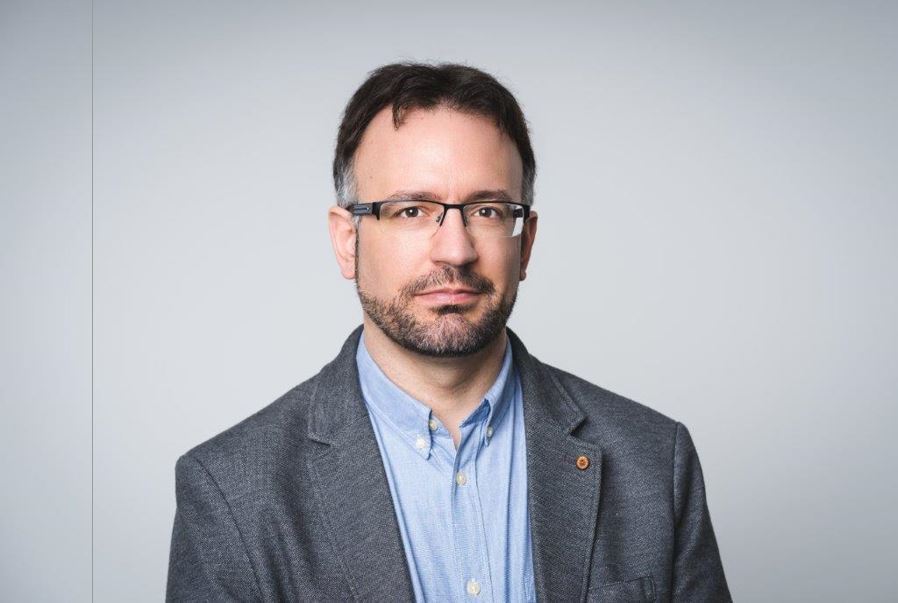

**Dr. Forstner Bertalan** a BME VIK Automatizálási és Alkalmazott Informatikai Tanszékének tanészkvezető-heyettese, a Kognitív Informatika kutatócsoport vezetője. Célja, hogy korszerű informatikai eszközökkel támogassa a tanulási nehézséggel küzdőket, illetve a gyerekek tehetségének kibontakoztatását.

<table class="picture">
<tr>
<td>

    
  
Dr. Forstner Bertalan

</td>
</tr>
</table>
