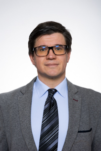

A Repüléstudományi és Hajózási Tanszék tanársegédje, elsődleges területe a pilóta nélküli légieszközök alkalmazása városi környezetben és az integrálásuk a hagyományos repülésbe.

<table class="picture">
<tr>
<td>

    
  
Gál István

</td>
</tr>
</table>
