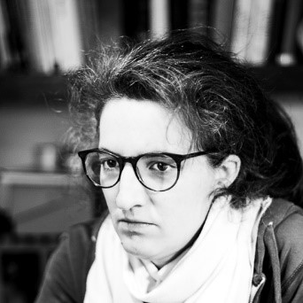

Építészmérnök, adjunktus a BME Szilárdságtani és Tartószerkezeti Karán. A ballonokról Hegyi Dezsőtől hallott először évekkel ezelőtt. A felállás változatlan, most is ő az, aki kérdez.

 <table class="picture">
<tr>
<td>

    
  
Dr. Gáspár Orsolya

</td>
</tr>
</table>
