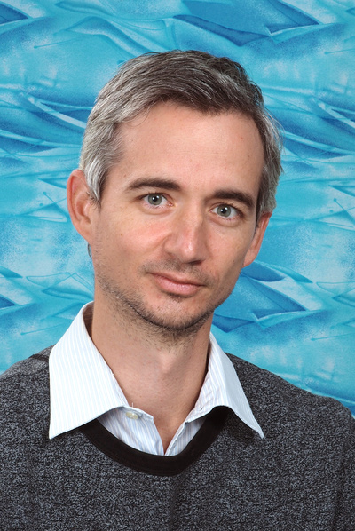

[Dr. Gézsi András](https://www.mit.bme.hu/munkatarsak/gezsi)

Dr. Gézsi András a Budapesti Műszaki és Gazdaságtudományi Egyetem Mesterséges Intelligencia és Rendszertervezés Tanszékének docense, a Mesterséges Intelligencia Kutatócsoport tagja. Oktatási és kutatási tevékenységének középpontjában a mesterséges intelligencia, a gépi tanulás és ezek orvosbiológiai, illetve egészségügyi alkalmazásai állnak. Kutatási témái között központi szerepet tölt be a biológiailag informált neurális hálózatok és a gráf neurális hálózatok vizsgálata. A BME-n többek között gépi tanulást, valamint egészségügyi informatikát és biostatisztikát oktat.

<table class="picture">
<tr>
<td>

    
  
Dr. Gézsi András

</td>
</tr>
</table>
