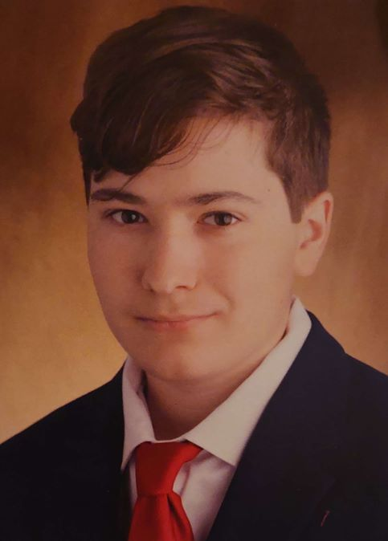

A BME Mechatronikai mérnök szakán BSc hallgató, valamint a BME Mechatronika Szakosztály konzultációs csoportjának vezetője. Kutatási területei az alacsony szintű-, és nagyteljesítményű szoftverfejlesztés. _E-mail címe:_ graffjoco@gmail.com

<table class="picture">
<tr>
<td>

    
  
Gräff József Balázs

</td>
</tr>
</table>
