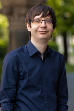

Okleveles gépészmérnök (MSc), jelenleg laborvezetőként dolgzik a HDR Tanszéken. Fő szakterülete az áramlástani méréstechnika. 

 <table class="picture">
<tr>
<td>

    
  
Gulyás András

</td>
</tr>
</table>
