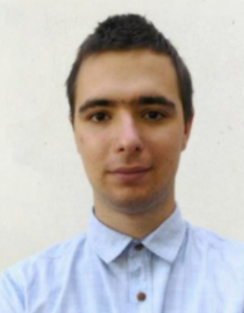

2020-ban szerzett mechatronikai mérnöki Bsc fokozatot a BME-n. Jelenleg Msc hallgató és a Mechatronika, Optika és Gépészeti Informatika Tanszék kutatási asszisztense. Érdeklődési és kutatási területe a biológiailag inspirált mesterséges intelligencia.

 <table class="picture">
<tr>
<td>

    
  
Gyöngyössy Natabara Máté

</td>
</tr>
</table>
