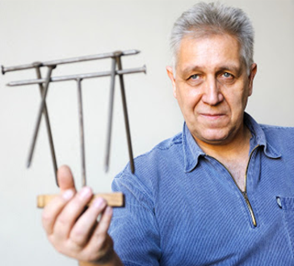

TTK, Fizikai Intézet

Härtlein Károly Prima Primissima díjas fizika szakos tanár, a BME Fizikai Intézet mesteroktatója. A tudományos ismeretterjesztés és a szkeptikus mozgalom egyik kiemelkedő alakja, számos televíziós sorozat házigazdája, szakértője.

 <table class="picture">
<tr>
<td>

    
  
Härtlein Károly

</td>
</tr>
</table>
