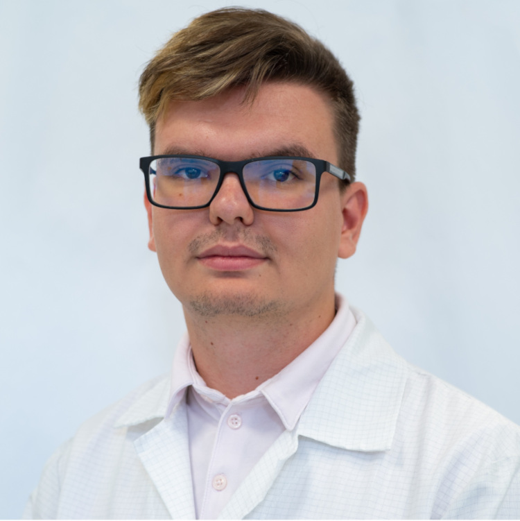

A BME Elektronikai Technológia Tanszékének doktorandusz hallgatója. Érdeklődési területei a mikrovezérlőkkel megvalósított komplett készülékek és mérőrendszerek; az elektronikai szereléstechnológiák.

 <table class="picture">
<tr>
<td>

    
  
Havellant Gergő

</td>
</tr>
</table>
