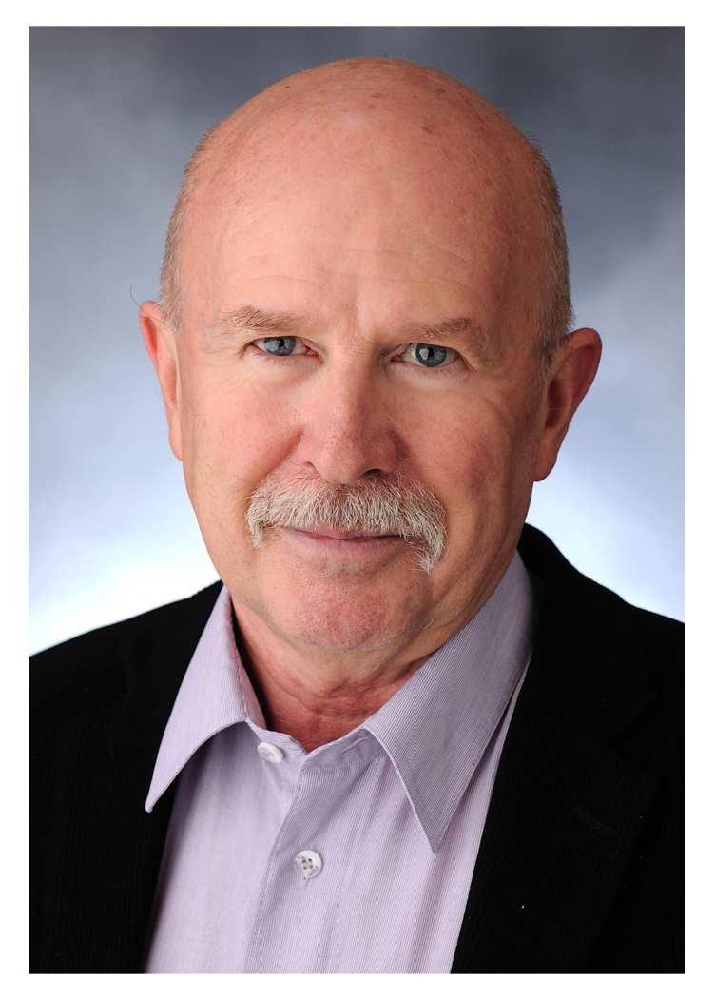

---
layout: page_kutej_profilok
tud_idopont: 0
kutej_programfelelos_eloado: Dr. Hazai László egyetemi magántanár
kutej_programfelelos: 
kutej_eloado:
---
1970-ben kaptam vegyészmérnöki oklevelet a BME Vegyészmérnöki Karán, 1971-1991 a MTA Kísérleti Orvostudományi Kutató Intézetben dolgoztam, majd 1991-ben kerültem a BME-re, ahol jelenleg a Szerves Kémia és Technológia Tanszék egyetemi magántanára vagyok. 1981-ben megszereztem a kémiai tudomány kandidátusa, 1991-ben pedig a kémiai tudomány doktora fokozatot. Kutatási témám: biológiailag aktív természetes anyagok kémiája. Oktatási feladataim: Biomolekulák kémiája előadás és laboratóriumi oktatás. Társszerzője vagyok a Biomolekulák kémiája c. egyetemi tankönyvnek. 2008-ban oktatói és pedagógiai munkámért Görög Jenő díjat, 2009-ben pedig a tudományos pályafutásom elismeréseként Zemplén Géza díjat kaptam. 2010 óta már több alkalommal, legutóbb 2019-ben a hallgatók szavazatai alapján a Műegyetem 100 legjobb oktatója közé kerültem.

 <table class="picture">
<tr>
<td>

    
  
Dr Hazai László

</td>
</tr>
</table>
