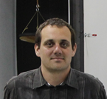

Építészmérnök, a BME Szilárdságtani és Tartószerkezeti Tanszékének vezetője. 2012-13-as tanévben vendégkutatóként a CALTECH (USA, Los Angeles) repülőmérnöki intézetében végzett kutatásokat a superpressure ballonokhoz használt LLDPE anyagok tönkremenetelével kapcsolatban.

 <table class="picture">
<tr>
<td>

    
  
Dr. Hegyi Dezső

</td>
</tr>
</table>
