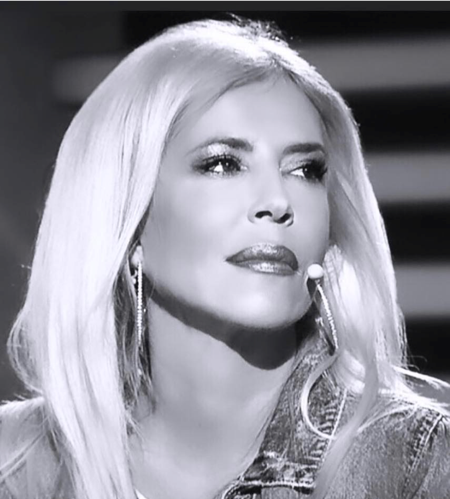

Az ELTE PPK Személyiség- és Egészségpszichológiai Tanszék, valamint az ELTE PPK Egészségfejlesztési és Sporttudományi Intézet egyetemi adjunktusa. Végzettsége szerint közgazdász, újságíró, pszichológus és pszichológia tanár; sportszakpszichológus (SE TF), egészségfejlesztő, és szexuálpszichológiai szakpszichológus (ELTE PPK), továbbá az European Society for Sexual Medicine ösztöndíjasaként folytatott tanulmányokat külföldön. A Magyar Pszichológiai Társaság Szexuálpszichológiai Szekciójának az elnöke.

 <table class="picture">
<tr>
<td>

    
  
Dr. Hevesi Krisztina

</td>
</tr>
</table>
