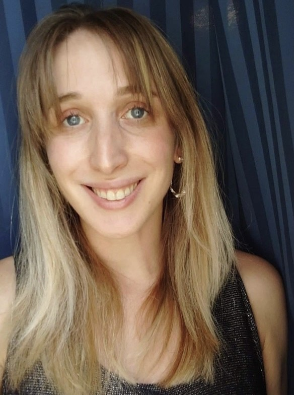

PhD hallgató, Környezetgazdaságtan és Fenntartható Fejlődés Tanszék

A BME-GTK nemzetközi gazdálkodás alapszak elvégzése után a regionális és környezeti gazdaságtan mesterszakon folytattam tanulmányaimat. Miután megszereztem mesterdiplomámat, megkezdtem PhD tanulmányaimat. Jelenleg harmadéves vagyok a BME Környezetgazdaságtan és Fenntartható Fejlődés Tanszékén, kutatási témám a városi átalakulások elemzése a fenntarthatóság és klíma-alkalmazkodás kapcsolatrendszerében.

 <table class="picture">
<tr>
<td>

    
  
Jäger Szimonetta

</td>
</tr>
</table>
