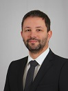

A Repüléstudományi és Hajózási Tanszék tanársegédje, elsődleges területe a repülésmechanika és aerodinamika. Szabadidejében pilótaként személyesen is gyakorolja a repülést.

<table class="picture">
<tr>
<td>

    
  
Jankovics István

</td>
</tr>
</table>
