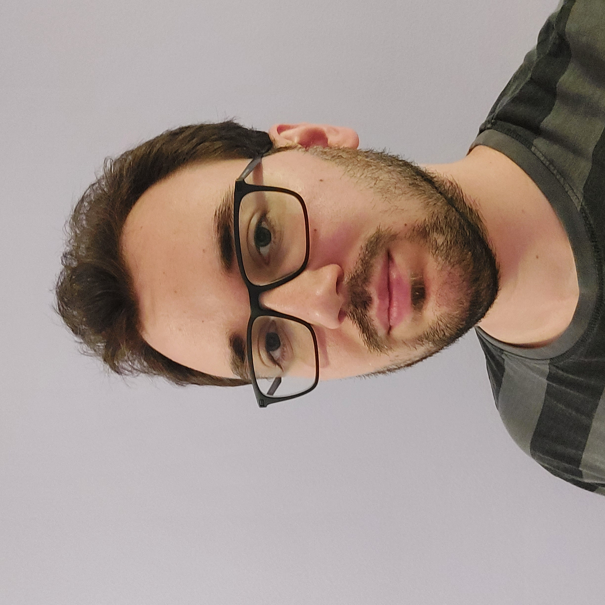

**Jeges Gábor:** A BME VIK MSc-s mérnökinformatikus hallgatója. Fő érdeklődési területe a nagy nyelvi modellek és a mobilfejlesztés.	

 <table class="picture">
<tr>
<td>

    
  
Jeges Gábor

</td>
</tr>
</table>
