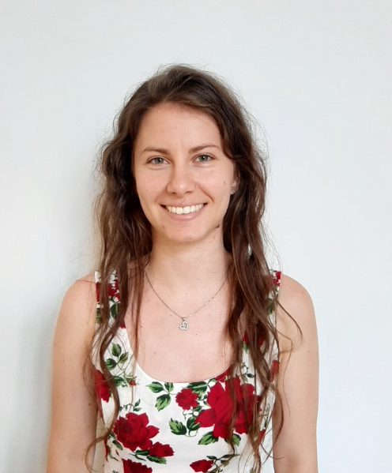

2016-ban harmadéves hallgató korában kapcsolódott be az ABÉT Gabonatudományi és Élelmiszerminőség kutatócsoport munkájába. 2017-ben BSc, 2019-ben MSc biomérnöki diplomát szerzett, majd 2024-ben védte meg doktori munkáját. Kutatási területe a gabonák szénhidrát, fehérje és bioaktívkomponens összetételének jellemzése elválasztástechnikai módszerekkel. Tudományos segédmunkatársként a vegyész és biomérnök hallgatók oktatásában is egyre nagyobb szerepet vállal.

<table class="picture">
<tr>
<td>

    
  
Juhászné Dr. Szentmiklóssy Marietta

</td>
</tr>
</table>
