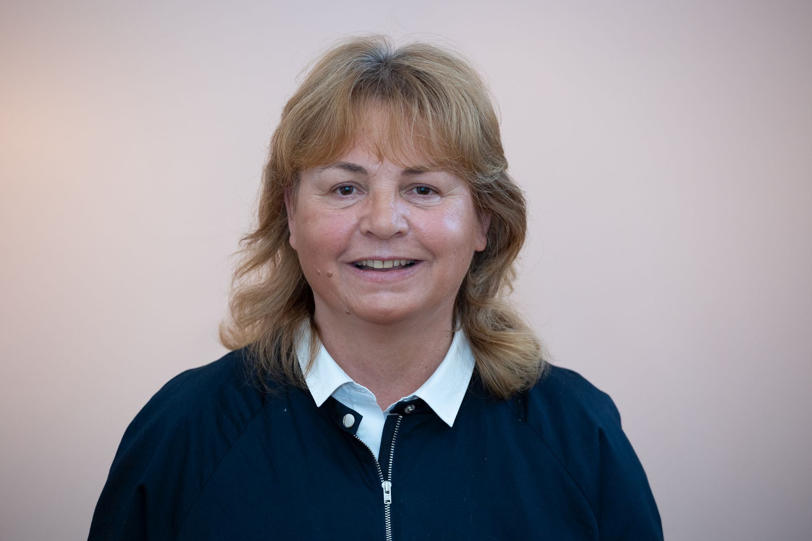

1999-ben szereztem doktori fokozatot a debreceni Kossuth Lajos Tudományegyetemen, 2007-ben habilitáltam a Budapesti Műszaki és Gazdaságtudományi Egyetem Alkalmazott Pedagógia és Pszichológia Intézetében. Szintén 2007 óta vagyok a BME Műszaki Pedagógia Tanszékének egyetemi docense, 2015-ben meghívott előadó voltam a finnországi University of Tampere-n. Számos hazai és nemzetközi kutatási projektben vettem részt, egyik fő kutatási területem az élethosszig tanulás. Fontos számomra a sport, szeretem a természetet és a zenét. https://www.mpt.bme.hu/dr-kalman-aniko/

 <table class="picture">
<tr>
<td>

    
  
Dr. Kálmán Anikó

</td>
</tr>
</table>
